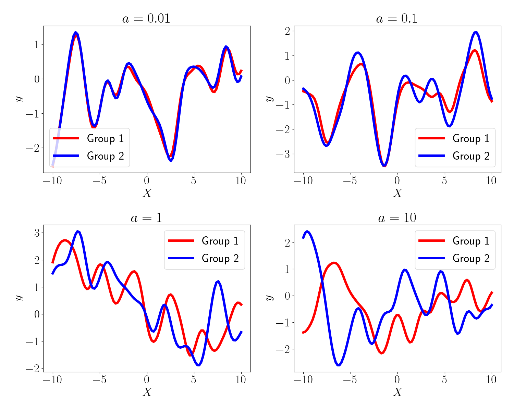
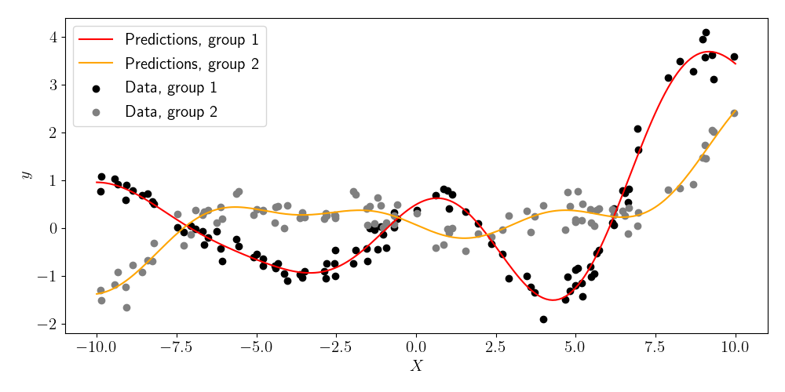

# Multi-group Gaussian process (MGGP)

The multi-group Gaussian process (MGGP) is a generalization of a traditional GP to the setting in which observations are partitioned into a set of known subgroups.

The multigroupGP package is written using [JAX](https://github.com/google/jax), a computing framework designed for autodifferentiation, just-in-time (JIT) compilation, and fast parallel computation.

## Installation

The MGGP software can be installed with `pip`:

`pip install multigroupGP`

## Usage

The multigroupGP package supports both standard GPs and multi-group GP. Crucially, the primary difference between multi- and single-group GPs is the choice of covariance function. In this README, we first show typical usage for standard GPs (since this is likely more familiar to users), and then show how to use the package in the multi-group setting.

### Covariance functions

Currently, there are four covariance implemented in the `multigroupGP` package:

- `rbf_kernel` (radial basis function kernel, also known as the exponential quadratic)
- `multigroup_rbf_kernel` (multi-group extension of the RBF kernel)
- `matern12_kernel` (Matérn 1/2 kernel)
- `multigroup_matern12_kernel` (multi-group extension of the Matérn 1/2 kernel)

### Standard GP

Given an `n x p` matrix `X` of explanatory variables and an `n`-vector `y` containing responses, a standard GP can be fit as follows:

```python
from multigroupGP import GP, rbf_kernel
gp = GP(kernel=rbf_kernel)
gp.fit(X, y)
```

After fitting, predictions can be made for a test matrix `Xtest` as follows:

```python
gp.predict(Xtest)
```

### Multi-group GP

If our data contains multiple known subgroups of samples, we can account for these with an MGGP. Suppose we again have an explanatory matrix `X` and response vector `y`, and we also have an `n`-vector of integer group labels, `Xgroups`. To initialize an MGGP, we have to make two changes:

1. Switch the `is_mggp` argument to `True`,
2. Use an appropriate multi-group covariance (kernel) function.

We can then fit an MGGP as follows:

```python
from multigroupGP import GP, multigroup_rbf_kernel
mggp = GP(kernel=multigroup_rbf_kernel, is_mggp=True)
mggp.fit(X, y, groups=Xgroups)
```

By default, the MGGP assumes that groups are equally similar to one another a priori. However, if we have prior knowledge about group similarities, we can encode this in the `group_distances` argument of the `fit` function. If we have `k` total groups, `group_distances` argument should be a `k x k` numpy array, where element `ij` contains the "distance" between group `i` and group `j` (lower values indicate that the groups are more similar). Note that the `group_distances` argument is only relevant when `k>2` because the distances will be arbitrarily rescaled during fitting in the two-group case. We can then fit the MGGP as follows:

```python
from multigroupGP import GP, multigroup_rbf_kernel
mggp = GP(kernel=multigroup_rbf_kernel, is_mggp=True)
mggp.fit(X, y, groups=Xgroups, group_distances=Xgroup_distances)
```

After fitting, predictions can be made for a test matrix `Xtest` as follows:

```python
mggp.predict(Xtest, groups_test=Xtest_groups)
```

## Interpretation of the `a` parameter

The multi-group covariance functions here each have a parameter `a` that controls the strength of similarity between groups. Heuristically, lower values of `a` correspond to MGGPs whose function draws are more similar across groups, and higher values of `a` correspond to MGGPs whose function draws are more dissimilar across groups. We visualize this below by sampling a function for each of two groups using the multi-group RBF kernel:

<p align="center">
  
</p>

## Example

Below is a full example for performing multi-group regression with the MGGP. See the `examples/` folder for more.

```python
import jax.numpy as jnp
import jax.random as random
import matplotlib.pyplot as plt
from multigroupGP import GP, multigroup_rbf_kernel
import numpy as onp

key = random.PRNGKey(1)

## True kernel parameters for data generation
true_params = [
    jnp.zeros(1),  # Amplitude
    jnp.zeros(1),  # Group difference parameter (a)
    jnp.zeros(1),  # Lengthscale
]
noise_variance = 0.05

## Generate data
n0, n1 = 100, 100
p = 1
n = n0 + n1
X0 = random.uniform(key, minval=-10, maxval=10, shape=(n0, 1))
X1 = random.uniform(key, minval=-10, maxval=10, shape=(n1, 1))
X = jnp.concatenate([X0, X1], axis=0)

group_dist_mat = onp.ones((2, 2))
onp.fill_diagonal(group_dist_mat, 0)

X_groups = onp.concatenate([onp.zeros(n0), onp.ones(n1)]).astype(int)

K_XX = (
    multigroup_rbf_kernel(
        true_params,
        x1=X,
        groups1=X_groups,
        group_distances=group_dist_mat,
    )
    + noise_variance * jnp.eye(n)
)
Y = random.multivariate_normal(random.PRNGKey(12), jnp.zeros(n), K_XX)

## Fit MGP
gp = GP(kernel=multigroup_rbf_kernel, key=key, is_mggp=True)
gp.fit(X, Y, groups=X_groups, group_distances=group_dist_mat)

## Make predictions
ntest = 200
Xtest_onegroup = jnp.linspace(-10, 10, ntest)[:, None]
Xtest = jnp.concatenate([Xtest_onegroup, Xtest_onegroup], axis=0)
Xtest_groups = onp.concatenate([onp.zeros(ntest), onp.ones(ntest)]).astype(int)
preds_mean = gp.predict(Xtest, groups_test=Xtest_groups)

## Plot
plt.figure(figsize=(10, 5))
plt.scatter(X[:n0], Y[:n0], color="black", label="Data, group 1")
plt.scatter(X[n0:], Y[n0:], color="gray", label="Data, group 2")
plt.plot(Xtest[:ntest], preds_mean[:ntest], color="red", label="Predictions, group 1")
plt.plot(
    Xtest[ntest:], preds_mean[ntest:], color="orange", label="Predictions, group 2"
)
plt.xlabel("X")
plt.ylabel("y")
plt.legend()
plt.show()
```

<p align="center">
  
</p>

## Experiments

Code for reproducing the experiments in the paper can be found in the `experiments/` folder.

## Bugs

Please open a GitHub issue to report bugs.

