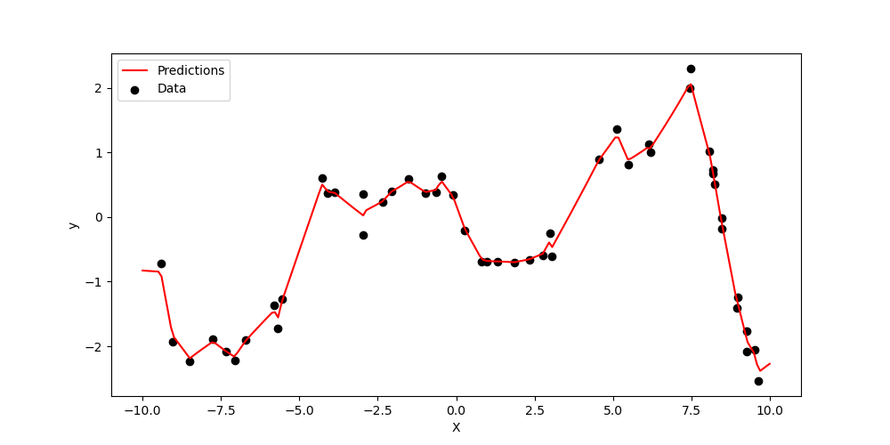

# Multi-group Gaussian process (MGGP)

The multi-group Gaussian process (MGGP) is a generalization of a traditional GP to the setting in which observations are partitioned into a set of known subgroups.

The multigroupGP package is written using [JAX](https://github.com/google/jax), a computing framework designed for autodifferentiation, just-in-time (JIT) compilation, and fast parallel computation.

## Installation

The MGGP software can be installed with `pip`:

`pip install multigroupGP`

## Usage

The multigroupGP package supports both standard GPs and multi-group GP. Crucially, the primary difference between multi- and single-group GPs is the choice of covariance function. We first show typical usage for standard GPs (since this is likely more familiar to users), and then show how to use the package in the multi-group setting.

### Standard GP

Given an `n x p` matrix `X` of explanatory variables and an `n`-vector `y` containing responses, a standard GP can be fit as follows:

```python
from multigroupGP import GP, rbf_kernel
gp = GP(kernel=rbf_kernel)
gp.fit(X, y)
```

After fitting, predictions can be made for a test matrix `Xtest` as follows:

```python
gp.predict(Xtest)
```

### Multi-group GP

If our data contains multiple known subgroups of samples, we can account for these with an MGGP. Suppose we again have an explanatory matrix `X` and response vector `y`, and we also have an `n`-vector of integer group labels, `Xgroups`. We can then fit an MGGP as follows:

```python
from multigroupGP import GP, multigroup_rbf_kernel
gp = GP(kernel=multigroup_rbf_kernel)
gp.fit(X, y, groups=Xgroups)
```

By default, the MGGP assumes that groups are equally similar to one another a priori. However, if we have prior knowledge about group similarities, we can encode this in the `group_distances` argument of the `fit` function. If we have `k` total groups, `group_distances` argument should be a `k x k` numpy array, where element `ij` contains the "distance" between group `i` and group `j` (lower values indicate that the groups are more similar). Note that the `group_distances` argument is only relevant when `k>2` because the distances will be arbitrarily rescaled during fitting in the two-group case. We can then fit the MGGP as follows:

```python
from multigroupGP import GP, multigroup_rbf_kernel
gp = GP(kernel=multigroup_rbf_kernel)
gp.fit(X, y, groups=Xgroups, group_distances=Xgroup_distances)
```

After fitting, predictions can be made for a test matrix `Xtest` as follows:

```python
gp.predict(Xtest, groups_test=Xtest_groups)
```

## Example

<p align="center">
  
</p>

